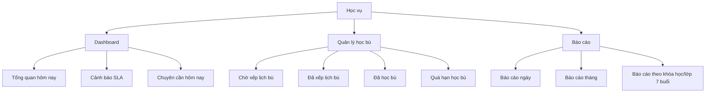
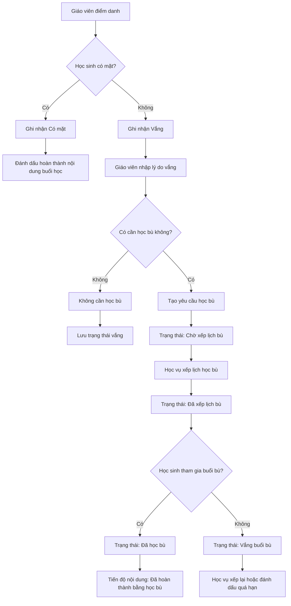

# Đặc tả nghiệp vụ cho AI Agent  
# Module Dashboard Học vụ, Chuyên cần, SLA, Học bù và Báo cáo

## 1. Mục đích tài liệu

Tài liệu này dùng làm đầu vào cho các AI Agent, lập trình viên, UI/UX Designer, Business Analyst, Backend Developer, Frontend Developer và Tester khi thiết kế, phân tích hoặc triển khai hệ thống quản lý đào tạo.

Tài liệu tập trung vào các phần:

- Dashboard tổng quan trong ngày cho Học vụ.
- Dashboard cảnh báo SLA.
- Dashboard chuyên cần học viên.
- Quản lý học bù.
- Báo cáo ngày.
- Báo cáo tháng.
- Báo cáo theo khóa học/lớp.
- Quy tắc điểm danh học sinh.
- Quy tắc xử lý học sinh vắng nhưng có học bù.
- Checklist nghiệm thu chức năng.

Hệ thống được xây dựng cho trung tâm đào tạo, trong đó một khóa học thông thường kéo dài **7 buổi**, mỗi tuần học **1 buổi**, chưa tính các buổi học bù phát sinh.

---

## 2. Vai trò người dùng liên quan

### 2.1. Học vụ

Học vụ là người quản lý vận hành đào tạo. Học vụ cần theo dõi tình hình lớp học hằng ngày, kiểm tra giáo viên có hoàn tất báo cáo sau buổi học không, theo dõi học sinh có mặt/vắng, quản lý học bù và xem báo cáo để đánh giá chất lượng lớp học.

Học vụ cần có quyền:

- Xem dashboard tổng quan trong ngày.
- Xem dashboard cảnh báo SLA.
- Xem dashboard chuyên cần học viên.
- Xem chi tiết buổi học.
- Theo dõi điểm danh.
- Theo dõi tài nguyên buổi học.
- Quản lý học bù.
- Xem báo cáo ngày.
- Xem báo cáo tháng.
- Xem báo cáo theo khóa học/lớp.
- Xuất báo cáo nếu cần.
- Nhắc giáo viên hoàn tất dữ liệu.
- Cập nhật thay giáo viên khi có lý do hợp lệ.
- Xử lý sự cố phát sinh.

### 2.2. Giáo viên

Giáo viên là người trực tiếp giảng dạy và cập nhật dữ liệu sau buổi học.

Giáo viên cần có quyền:

- Xem lịch dạy cá nhân.
- Xem lớp được phân công.
- Xem bài giảng chuẩn.
- Điểm danh học sinh.
- Upload tài nguyên buổi học.
- Phản hồi cảnh báo từ Học vụ.
- Xác nhận thông tin học bù nếu được phân công.

### 2.3. Admin Sys

Admin Sys quản trị hệ thống, tài khoản, phân quyền và cấu hình lõi.

Admin Sys có thể xem báo cáo tổng quan, nhưng không phải người xử lý chính các nghiệp vụ lớp học hằng ngày.

---

## 3. Nguyên tắc điểm danh học sinh

### 3.1. Trạng thái điểm danh chính

Học sinh chỉ có **2 trạng thái điểm danh chính**:

| Trạng thái | Ý nghĩa |
|---|---|
| Có mặt | Học sinh tham gia buổi học chính thức |
| Vắng | Học sinh không tham gia buổi học chính thức |

Không sử dụng trạng thái "Đi muộn" như một trạng thái điểm danh chính.

Nếu cần ghi nhận học sinh đến trễ, hệ thống có thể lưu trong phần ghi chú, nhưng không tính là một trạng thái điểm danh riêng.

Ví dụ:

```text
attendance_status = PRESENT
attendance_status = ABSENT
```

---

## 4. Nguyên tắc xử lý học sinh vắng nhưng có học bù

### 4.1. Quy tắc cốt lõi

Nếu học sinh vắng buổi học chính nhưng sau đó học bù, hệ thống **không được đổi trạng thái điểm danh của buổi chính từ "Vắng" thành "Có mặt"**.

Hệ thống phải ghi nhận theo 2 lớp dữ liệu riêng:

| Loại dữ liệu | Cách ghi nhận |
|---|---|
| Điểm danh buổi chính | Vẫn là Vắng |
| Trạng thái học bù | Cập nhật riêng theo tiến trình học bù |

Ví dụ:

```text
Điểm danh buổi chính: Vắng
Trạng thái học bù: Đã học bù
Tiến độ nội dung: Đã hoàn thành bằng buổi học bù
```

### 4.2. Lý do không được đổi "Vắng" thành "Có mặt"

Nếu đổi trạng thái vắng thành có mặt sau khi học sinh học bù, báo cáo chuyên cần sẽ bị sai.

Ví dụ: Một học sinh vắng 3/7 buổi nhưng học bù đủ 3 buổi. Nếu hệ thống đổi các buổi đó thành "Có mặt", báo cáo sẽ hiểu sai rằng học sinh đi học đầy đủ 7/7 buổi chính thức.

Cách đúng là:

| Dữ liệu | Sau khi học bù có thay đổi không? |
|---|---|
| Điểm danh buổi chính | Không đổi, vẫn là Vắng |
| Trạng thái học bù | Chuyển thành Đã học bù |
| Tiến độ nội dung | Chuyển thành Đã hoàn thành |
| Cảnh báo rủi ro học tập | Có thể đóng hoặc giảm mức độ |
| Báo cáo chuyên cần | Vẫn ghi nhận lượt vắng |

---

## 5. Trạng thái học bù

Hệ thống cần quản lý trạng thái học bù riêng với điểm danh.

| Trạng thái học bù | Ý nghĩa |
|---|---|
| Không cần học bù | Buổi vắng không yêu cầu học bù |
| Cần học bù | Học sinh vắng và cần học lại nội dung |
| Chờ xếp lịch bù | Chưa có lịch học bù cụ thể |
| Đã xếp lịch bù | Đã có ngày/ca học bù |
| Đã học bù | Học sinh đã hoàn thành buổi học bù |
| Vắng buổi bù | Học sinh tiếp tục vắng trong buổi học bù |
| Quá hạn học bù | Quá thời gian cho phép nhưng học sinh chưa học bù |
| Hủy học bù | Buổi học bù bị hủy hoặc không còn yêu cầu bù |

Gợi ý mã trạng thái:

```text
NOT_REQUIRED
MAKEUP_REQUIRED
MAKEUP_PENDING
MAKEUP_SCHEDULED
MAKEUP_COMPLETED
MAKEUP_ABSENT
MAKEUP_EXPIRED
MAKEUP_CANCELLED
```

---

## 6. Các màn hình cần có cho Học vụ

Hệ thống cần có tối thiểu **8 màn hình chính** cho Học vụ liên quan đến dashboard, chuyên cần, học bù và báo cáo.

| STT | Màn hình | Mục đích |
|---|---|---|
| 1 | Dashboard tổng quan trong ngày | Xem nhanh tình hình lớp học hôm nay |
| 2 | Dashboard cảnh báo SLA | Theo dõi lớp sắp quá hạn, lớp vi phạm SLA và giáo viên thiếu báo cáo |
| 3 | Dashboard chuyên cần hôm nay | Theo dõi học sinh có mặt/vắng trong ngày |
| 4 | Chi tiết buổi học | Xem điểm danh, nhật ký, tài nguyên và trạng thái SLA của một buổi học |
| 5 | Quản lý học bù | Theo dõi học sinh vắng, chờ học bù, đã xếp lịch bù, đã học bù |
| 6 | Báo cáo ngày | Tổng kết vận hành từng ngày |
| 7 | Báo cáo tháng | Đánh giá chất lượng vận hành theo tháng |
| 8 | Báo cáo theo khóa học/lớp | Đánh giá trọn vẹn một khóa học 7 buổi |

Cấu trúc menu đề xuất:

```text
Học vụ
├── Dashboard
│   ├── Tổng quan hôm nay
│   ├── Cảnh báo SLA
│   └── Chuyên cần hôm nay
│
├── Quản lý học bù
│   ├── Chờ xếp lịch bù
│   ├── Đã xếp lịch bù
│   ├── Đã học bù
│   └── Quá hạn học bù
│
├── Báo cáo
│   ├── Báo cáo ngày
│   ├── Báo cáo tháng
│   └── Báo cáo theo khóa học/lớp
```

---

# 7. Màn hình 1: Dashboard tổng quan trong ngày

## 7.1. Mục tiêu

Dashboard tổng quan trong ngày giúp Học vụ mở hệ thống lên là biết ngay hôm nay trung tâm đang vận hành như thế nào.

Màn hình này trả lời các câu hỏi:

- Hôm nay có bao nhiêu buổi học?
- Bao nhiêu buổi chưa diễn ra?
- Bao nhiêu buổi đang diễn ra?
- Bao nhiêu buổi đã kết thúc?
- Bao nhiêu buổi đang chờ báo cáo?
- Bao nhiêu buổi đã hoàn thành đầy đủ?
- Bao nhiêu buổi sắp vi phạm SLA?
- Bao nhiêu buổi đã vi phạm SLA?
- Có sự cố nào cần xử lý không?

## 7.2. Chỉ số cần hiển thị

| Chỉ số | Ý nghĩa | Cách tính |
|---|---|---|
| Tổng số buổi học hôm nay | Tổng số buổi học được xếp lịch trong ngày | Đếm tất cả buổi học có ngày học là hôm nay |
| Chưa diễn ra | Buổi học đã lên lịch nhưng chưa tới giờ bắt đầu | Giờ hiện tại < giờ bắt đầu |
| Đang diễn ra | Buổi học đang trong thời gian học | Giờ bắt đầu <= hiện tại <= giờ kết thúc |
| Đã kết thúc | Buổi học đã qua giờ kết thúc | Hiện tại > giờ kết thúc |
| Chờ báo cáo | Buổi học đã kết thúc nhưng giáo viên chưa cập nhật đủ dữ liệu | Thiếu điểm danh, nhật ký hoặc tài nguyên bắt buộc |
| Hoàn thành | Buổi học đã đủ điểm danh, nhật ký và tài nguyên | Đầy đủ dữ liệu bắt buộc |
| Sắp vi phạm SLA | Gần quá hạn cập nhật báo cáo | Ví dụ còn dưới 30 phút trước hạn SLA |
| Vi phạm SLA | Quá hạn nhưng vẫn thiếu dữ liệu | Quá thời gian SLA mà chưa hoàn tất |
| Sự cố cần xử lý | Các vấn đề cần Học vụ can thiệp | Đếm sự cố trạng thái OPEN hoặc IN_PROGRESS |

## 7.3. Ví dụ thẻ chỉ số

```text
Tổng buổi học hôm nay: 12
Chưa diễn ra: 3
Đang diễn ra: 2
Đã kết thúc: 7
Chờ báo cáo: 2
Hoàn thành: 5
Sắp vi phạm SLA: 1
Vi phạm SLA: 1
Sự cố cần xử lý: 1
```

## 7.4. Bảng chi tiết

| Lớp | Buổi | Giáo viên | Giờ học | Trạng thái | Điểm danh | Nhật ký | Tài nguyên | SLA | Hành động |
|---|---|---|---|---|---|---|---|---|---|
| Robotics A1 | Buổi 3/7 | GV A | 17:30 | Chờ báo cáo | Đã có | Thiếu | Thiếu | Warning | Nhắc GV |
| Scratch B1 | Buổi 5/7 | GV B | 18:00 | Hoàn thành | Đã có | Đã có | Đã có | Đúng hạn | Xem |
| Python C1 | Buổi 2/7 | GV C | 15:00 | Vi phạm SLA | Thiếu | Thiếu | Thiếu | Vi phạm | Tạo sự cố |

## 7.5. Hành động nhanh

| Hành động | Ý nghĩa |
|---|---|
| Xem chi tiết | Mở màn hình chi tiết buổi học |
| Nhắc giáo viên | Gửi thông báo yêu cầu giáo viên hoàn tất dữ liệu |
| Cập nhật thay | Học vụ cập nhật thay giáo viên khi có lý do hợp lệ |
| Tạo sự cố | Chuyển cảnh báo thành sự cố |
| Đóng sự cố | Đóng sự cố sau khi đã xử lý |

---

# 8. Màn hình 2: Dashboard cảnh báo SLA

## 8.1. Mục tiêu

Dashboard cảnh báo SLA giúp Học vụ kiểm soát việc giáo viên có hoàn tất dữ liệu sau buổi học đúng hạn hay không.

SLA trong hệ thống này được hiểu là thời hạn giáo viên phải hoàn tất báo cáo sau buổi học.

Báo cáo sau buổi học gồm:

- Điểm danh học sinh.
- Tài nguyên buổi học nếu bắt buộc.
- Lý do học sinh vắng nếu có học sinh vắng.

## 8.2. Các nhóm cảnh báo SLA

| Nhóm cảnh báo | Điều kiện |
|---|---|
| Chưa điểm danh | Buổi học kết thúc nhưng chưa có dữ liệu điểm danh |
| Chưa nhập lý do vắng | Có học sinh vắng nhưng giáo viên chưa nhập lý do |
| Chưa nhập nhật ký | Giáo viên chưa cập nhật nội dung thực tế đã dạy |
| Chưa upload tài nguyên | Thiếu video, file, link tài liệu hoặc tài nguyên buổi học |
| Sắp quá hạn SLA | Gần hết thời gian cập nhật báo cáo |
| Vi phạm SLA | Quá thời gian quy định nhưng chưa hoàn tất |
| Giáo viên nộp trễ nhiều lần | Một giáo viên có nhiều lần vi phạm trong tháng |

## 8.3. Mốc thời gian kiểm tra

| Thời điểm sau buổi học | Hệ thống kiểm tra | Cách xử lý |
|---|---|---|
| Ngay khi kết thúc | Kiểm tra trạng thái buổi học | Chuyển sang Chờ báo cáo |
| Sau 30 phút | Kiểm tra điểm danh và lý do vắng | Nhắc giáo viên |
| Sau 60 phút | Kiểm tra nhật ký buổi học | Cảnh báo giáo viên và hiển thị cho Học vụ |
| Sau 6 tiếng | Kiểm tra tài nguyên | Cảnh báo thiếu tài nguyên |
| Sau 6 tiếng | Kiểm tra toàn bộ báo cáo | Tạo vi phạm SLA và sự cố |

Thời gian SLA 120 phút phải là tham số có thể cấu hình trong hệ thống.

## 8.4. Bảng dashboard SLA

| Lớp | Buổi | Giáo viên | Kết thúc lúc | Còn thiếu | Thời gian trễ | Mức độ | Hành động |
|---|---|---|---|---|---|---|---|
| Robotics A1 | Buổi 3/7 | GV A | 17:30 | Nhật ký, tài nguyên | 55 phút | Warning | Nhắc GV |
| Python C1 | Buổi 2/7 | GV C | 15:00 | Điểm danh, nhật ký | 130 phút | Vi phạm SLA | Tạo sự cố |
| Scratch B1 | Buổi 5/7 | GV B | 18:00 | Tài nguyên | 80 phút | Warning | Xem chi tiết |

## 8.5. Hành động nhanh

| Hành động | Mục đích |
|---|---|
| Nhắc giáo viên | Gửi thông báo yêu cầu hoàn tất |
| Xem chi tiết buổi học | Kiểm tra điểm danh, nhật ký, tài nguyên |
| Cập nhật thay giáo viên | Học vụ nhập thay khi có lý do hợp lệ |
| Tạo sự cố | Chuyển cảnh báo thành incident |
| Đóng cảnh báo | Đóng khi đã xử lý |

Khi Học vụ cập nhật thay giáo viên, hệ thống bắt buộc nhập lý do.

Ví dụ lý do:

```text
Giáo viên báo lỗi mạng, Học vụ cập nhật thay theo thông tin giáo viên gửi qua Zalo.
```

---

# 9. Màn hình 3: Dashboard chuyên cần hôm nay

## 9.1. Mục tiêu

Dashboard chuyên cần hôm nay giúp Học vụ theo dõi tình hình có mặt/vắng của học sinh trong ngày.

Vì học sinh chỉ có 2 trạng thái điểm danh chính, màn hình này phải đơn giản, dễ đọc, nhưng vẫn cần theo dõi riêng việc học bù.

## 9.2. Chỉ số cần hiển thị

| Chỉ số | Ý nghĩa |
|---|---|
| Tổng lượt học sinh hôm nay | Tổng số học sinh cần điểm danh trong các buổi học hôm nay |
| Có mặt | Số lượt học sinh tham gia buổi học chính |
| Vắng | Số lượt học sinh không tham gia buổi học chính |
| Tỷ lệ có mặt | Có mặt / Tổng lượt học sinh |
| Tỷ lệ vắng | Vắng / Tổng lượt học sinh |
| Vắng có lý do | Học sinh vắng nhưng có lý do |
| Vắng chưa có lý do | Học sinh vắng nhưng giáo viên chưa nhập lý do |
| Cần học bù | Học sinh vắng và cần bù nội dung |
| Đã xếp lịch bù | Học sinh vắng đã có lịch học bù |
| Đã học bù | Học sinh đã hoàn thành buổi bù |

## 9.3. Ví dụ thẻ chỉ số

```text
Tổng lượt học sinh hôm nay: 86
Có mặt: 78
Vắng: 8
Tỷ lệ có mặt: 90.7%
Tỷ lệ vắng: 9.3%
Vắng có lý do: 5
Vắng chưa có lý do: 3
Cần học bù: 6
Đã xếp lịch bù: 2
Đã học bù: 1
```

## 9.4. Bảng chi tiết

| Học sinh | Lớp | Buổi | Điểm danh | Lý do vắng | Có cần học bù? | Trạng thái học bù | Hành động |
|---|---|---|---|---|---|---|---|
| Nguyễn A | Robotics A1 | Buổi 3/7 | Vắng | Ốm | Có | Chờ xếp lịch bù | Xếp lịch bù |
| Trần B | Scratch B1 | Buổi 5/7 | Có mặt | — | Không | Không cần | Xem |
| Lê C | Python C1 | Buổi 2/7 | Vắng | Chưa nhập | Có | Chưa xử lý | Nhắc GV nhập lý do |
| Phạm D | Robotics A2 | Buổi 4/7 | Vắng | Việc gia đình | Có | Đã xếp lịch bù | Theo dõi |

---

# 10. Màn hình 4: Chi tiết buổi học

## 10.1. Mục tiêu

Màn hình chi tiết buổi học cho phép Học vụ hoặc Giáo viên xem toàn bộ dữ liệu của một buổi học cụ thể.

## 10.2. Thông tin cần hiển thị

| Nhóm thông tin | Dữ liệu |
|---|---|
| Thông tin buổi học | Lớp, khóa học, buổi số, ngày học, ca học, phòng học/link online |
| Giáo viên | Giáo viên phụ trách |
| Bài giảng | Tên bài, mục tiêu, nội dung, link PPT, link Canva, tài liệu |
| Điểm danh | Danh sách học sinh, trạng thái có mặt/vắng, lý do vắng |
| Nhật ký | Nội dung thực tế đã dạy, mức độ hoàn thành, nhận xét lớp |
| Tài nguyên | Video, tài liệu, link bài học, bài làm mẫu |
| SLA | Thời điểm kết thúc, thời hạn báo cáo, trạng thái SLA |
| Cảnh báo | Các cảnh báo liên quan đến buổi học |
| Lịch sử thao tác | Ai đã cập nhật, cập nhật lúc nào, nội dung thay đổi |

## 10.3. Hành động

| Hành động | Ai được thực hiện |
|---|---|
| Xem chi tiết | Học vụ, Giáo viên phụ trách, Admin Sys |
| Cập nhật điểm danh | Giáo viên phụ trách, Học vụ khi cần |
| Cập nhật nhật ký | Giáo viên phụ trách, Học vụ khi cần |
| Upload tài nguyên | Giáo viên phụ trách, Học vụ khi cần |
| Cập nhật thay giáo viên | Học vụ |
| Nhắc giáo viên | Học vụ |
| Tạo sự cố | Học vụ |
| Đóng sự cố | Học vụ |

---

# 11. Màn hình 5: Quản lý học bù

## 11.1. Mục tiêu

Màn hình quản lý học bù giúp Học vụ theo dõi toàn bộ học sinh vắng cần học bù, trạng thái xếp lịch bù và tình trạng hoàn thành học bù.

Màn hình này rất quan trọng vì một khóa học có 7 buổi, mỗi tuần học 1 buổi, nhưng thực tế có thể phát sinh nhiều buổi bù.

## 11.2. Bảng quản lý học bù

| Học sinh | Lớp chính | Buổi vắng | Nội dung cần bù | Ngày vắng | Lịch bù | Giáo viên bù | Trạng thái | Hành động |
|---|---|---|---|---|---|---|---|---|
| Nguyễn A | Robotics A1 | Buổi 3/7 | Cảm biến siêu âm | 10/07 | 13/07 | GV B | Đã xếp lịch | Xác nhận học bù |
| Lê C | Python C1 | Buổi 2/7 | Biến và kiểu dữ liệu | 09/07 | — | — | Chờ xếp lịch | Xếp lịch |
| Phạm D | Scratch B1 | Buổi 5/7 | Vòng lặp | 08/07 | 12/07 | GV A | Vắng buổi bù | Xếp lại |

## 11.3. Hành động cần có

| Hành động | Ý nghĩa |
|---|---|
| Xếp lịch học bù | Tạo lịch học bù cho học sinh |
| Chỉnh lịch học bù | Thay đổi lịch học bù đã tạo |
| Gán giáo viên bù | Chọn giáo viên phụ trách buổi bù |
| Xác nhận đã học bù | Đánh dấu học sinh đã hoàn thành học bù |
| Ghi nhận vắng buổi bù | Đánh dấu học sinh tiếp tục vắng ở buổi bù |
| Xếp lại lịch bù | Tạo lịch bù mới sau khi học sinh vắng buổi bù |
| Hủy yêu cầu học bù | Hủy nếu không còn cần học bù |
| Ghi chú xử lý | Lưu lý do hoặc ghi chú của Học vụ |

---

# 12. Màn hình 6: Báo cáo ngày

## 12.1. Mục tiêu

Báo cáo ngày là bản tổng kết vận hành trong một ngày cụ thể. Học vụ dùng báo cáo này để kiểm tra cuối ngày và rà soát các việc còn tồn đọng.

## 12.2. Nhóm dữ liệu cần có

| Nhóm dữ liệu | Nội dung |
|---|---|
| Vận hành lớp học | Tổng buổi học, hoàn thành, chờ báo cáo, vi phạm SLA |
| Giáo viên | Giáo viên nộp đúng hạn, nộp trễ, thiếu nhật ký, thiếu tài nguyên |
| Học sinh | Tổng lượt học sinh, có mặt, vắng, cần học bù |
| Học bù | Đã xếp lịch bù, đã học bù, quá hạn học bù |
| Sự cố | Sự cố mới, đang xử lý, đã đóng |
| Tài nguyên | Buổi học đã có video/tài liệu, buổi học còn thiếu |

## 12.3. Ví dụ báo cáo ngày

```text
Báo cáo ngày 10/07/2026

Tổng buổi học: 12
Buổi hoàn thành đầy đủ: 9
Buổi chờ báo cáo: 2
Buổi vi phạm SLA: 1

Tổng lượt học sinh: 86
Có mặt: 78
Vắng: 8
Tỷ lệ có mặt: 90.7%

Học sinh cần học bù: 6
Đã xếp lịch bù: 2
Đã học bù: 1
Quá hạn học bù: 0
```

---

# 13. Màn hình 7: Báo cáo tháng

## 13.1. Mục tiêu

Báo cáo tháng giúp Học vụ đánh giá chất lượng vận hành trong một tháng.

Nếu hệ thống có báo cáo ngày thì bắt buộc nên có báo cáo tháng để Học vụ có thể xem lại, so sánh và đánh giá chất lượng thường xuyên.

## 13.2. Nhóm chỉ số cần có

| Nhóm | Chỉ số cần xem |
|---|---|
| Tổng quan vận hành | Tổng số buổi học trong tháng, số buổi hoàn thành, số buổi vi phạm SLA |
| Chất lượng giáo viên | Tỷ lệ nộp báo cáo đúng hạn, số lần thiếu điểm danh, thiếu nhật ký, thiếu tài nguyên |
| Chuyên cần học sinh | Tổng lượt có mặt, tổng lượt vắng, tỷ lệ có mặt |
| Học bù | Số lượt cần học bù, đã học bù, chưa học bù, quá hạn học bù |
| Chất lượng lớp học | Lớp có tỷ lệ vắng cao, lớp nhiều sự cố, lớp hoàn thành tốt |

## 13.3. Báo cáo tháng theo lớp

| Lớp | Khóa học | Số buổi trong tháng | Có mặt | Vắng | Tỷ lệ có mặt | Cần học bù | Đã học bù | SLA vi phạm | Đánh giá |
|---|---|---:|---:|---:|---:|---:|---:|---:|---|
| Robotics A1 | Robotics cơ bản | 4 | 42 | 6 | 87.5% | 5 | 3 | 1 | Cần theo dõi |
| Scratch B1 | Scratch cơ bản | 4 | 50 | 2 | 96.1% | 2 | 2 | 0 | Tốt |
| Python C1 | Python nền tảng | 4 | 36 | 8 | 81.8% | 7 | 2 | 2 | Rủi ro |

## 13.4. Báo cáo tháng theo giáo viên

| Giáo viên | Số buổi dạy | Đúng hạn | Trễ SLA | Thiếu điểm danh | Thiếu nhật ký | Thiếu tài nguyên | Đánh giá |
|---|---:|---:|---:|---:|---:|---:|---|
| GV A | 18 | 16 | 2 | 1 | 2 | 1 | Khá |
| GV B | 15 | 15 | 0 | 0 | 0 | 1 | Tốt |
| GV C | 12 | 9 | 3 | 2 | 3 | 2 | Cần nhắc nhở |

## 13.5. Bộ lọc báo cáo tháng

Báo cáo tháng cần có bộ lọc:

- Tháng/năm.
- Cơ sở nếu trung tâm có nhiều cơ sở.
- Khóa học.
- Lớp học.
- Giáo viên.
- Trạng thái SLA.
- Trạng thái học bù.
- Tỷ lệ chuyên cần.

---

# 14. Màn hình 8: Báo cáo theo khóa học/lớp 7 buổi

## 14.1. Mục tiêu

Báo cáo theo khóa học/lớp dùng để đánh giá trọn vẹn một lớp học từ buổi 1 đến buổi 7.

Vì khóa học thường kéo dài 7 buổi, báo cáo này phải hiển thị tiến độ theo từng buổi.

## 14.2. Bảng tiến độ 7 buổi

| Buổi | Ngày học | Giáo viên | Có mặt | Vắng | Tỷ lệ có mặt | Nhật ký | Tài nguyên | SLA | Học bù phát sinh |
|---|---|---|---:|---:|---:|---|---|---|---:|
| Buổi 1/7 | 01/07 | GV A | 10 | 1 | 90.9% | Đã có | Đã có | Đúng hạn | 1 |
| Buổi 2/7 | 08/07 | GV A | 9 | 2 | 81.8% | Đã có | Thiếu | Warning | 2 |
| Buổi 3/7 | 15/07 | GV A | 11 | 0 | 100% | Đã có | Đã có | Đúng hạn | 0 |
| Buổi 4/7 | 22/07 | GV A | — | — | — | Chưa học | Chưa có | — | — |
| Buổi 5/7 | 29/07 | GV A | — | — | — | Chưa học | Chưa có | — | — |
| Buổi 6/7 | 05/08 | GV A | — | — | — | Chưa học | Chưa có | — | — |
| Buổi 7/7 | 12/08 | GV A | — | — | — | Chưa học | Chưa có | — | — |

## 14.3. Chỉ số tổng kết lớp 7 buổi

| Chỉ số | Ý nghĩa |
|---|---|
| Số buổi đã học / 7 | Theo dõi tiến độ khóa |
| Số buổi còn lại | Biết lớp còn bao nhiêu buổi |
| Tỷ lệ có mặt trung bình | Đánh giá chuyên cần của lớp |
| Tổng lượt vắng | Tổng số lượt học sinh vắng trong khóa |
| Số lượt cần học bù | Tổng số buổi vắng cần bù |
| Số lượt đã học bù | Đã xử lý được bao nhiêu lượt |
| Số lượt chưa học bù | Còn tồn đọng bao nhiêu |
| Số lần giáo viên vi phạm SLA | Đánh giá quy trình giáo viên |
| Số buổi thiếu tài nguyên | Đánh giá chất lượng dữ liệu sau buổi học |
| Số sự cố phát sinh | Đánh giá rủi ro vận hành lớp |

## 14.4. Báo cáo từng học sinh trong khóa 7 buổi

| Học sinh | Buổi 1 | Buổi 2 | Buổi 3 | Buổi 4 | Buổi 5 | Buổi 6 | Buổi 7 | Vắng | Đã học bù | Hoàn thành nội dung |
|---|---|---|---|---|---|---|---|---:|---:|---:|
| Nguyễn A | Có mặt | Có mặt | Vắng + Đã bù | Có mặt | Vắng | Có mặt | Chưa học | 2 | 1 | 5/6 |
| Trần B | Có mặt | Có mặt | Có mặt | Có mặt | Có mặt | Có mặt | Chưa học | 0 | 0 | 6/6 |
| Lê C | Vắng | Có mặt | Vắng | Có mặt | Có mặt | Vắng + Đã bù | Chưa học | 3 | 1 | 4/6 |

---

# 15. Công thức tính báo cáo

## 15.1. Theo ngày

```text
Tổng lượt học sinh trong ngày = Tổng số học sinh có lịch học trong ngày

Tỷ lệ có mặt ngày = Số lượt có mặt / Tổng lượt học sinh trong ngày

Tỷ lệ vắng ngày = Số lượt vắng / Tổng lượt học sinh trong ngày
```

## 15.2. Theo tháng

```text
Tổng lượt học trong tháng = Tổng số học sinh của tất cả buổi học trong tháng

Tỷ lệ có mặt tháng = Tổng lượt có mặt / Tổng lượt học trong tháng

Tỷ lệ vắng tháng = Tổng lượt vắng / Tổng lượt học trong tháng

Tỷ lệ hoàn thành học bù = Số lượt đã học bù / Số lượt cần học bù
```

## 15.3. Theo khóa học 7 buổi

```text
Tỷ lệ chuyên cần khóa = Tổng số lượt có mặt trong 7 buổi / Tổng số lượt học sinh cần học trong 7 buổi

Tỷ lệ hoàn thành nội dung = (Tổng số lượt có mặt + Tổng số lượt đã học bù) / Tổng số lượt học sinh cần học trong 7 buổi

Tỷ lệ học bù còn tồn = Số lượt chưa học bù / Số lượt cần học bù
```

## 15.4. Theo từng học sinh

Ví dụ một học sinh đã phát sinh 6 buổi trong khóa 7 buổi:

| Buổi | Điểm danh chính | Học bù | Tiến độ nội dung |
|---|---|---|---|
| Buổi 1 | Có mặt | Không cần | Hoàn thành |
| Buổi 2 | Có mặt | Không cần | Hoàn thành |
| Buổi 3 | Vắng | Đã học bù | Hoàn thành bằng học bù |
| Buổi 4 | Có mặt | Không cần | Hoàn thành |
| Buổi 5 | Vắng | Chưa học bù | Chưa hoàn thành |
| Buổi 6 | Có mặt | Không cần | Hoàn thành |
| Buổi 7 | Chưa học | — | Chưa phát sinh |

Kết quả:

```text
Số buổi chính đã có mặt = 4
Số buổi vắng = 2
Số buổi đã học bù = 1
Số nội dung đã hoàn thành = 5/6
Tỷ lệ có mặt chính thức = 4/6 = 66.7%
Tỷ lệ hoàn thành nội dung = 5/6 = 83.3%
```

---

# 16. Trạng thái buổi học

Hệ thống nên có các trạng thái buổi học sau:

| Trạng thái | Ý nghĩa |
|---|---|
| SCHEDULED | Buổi học đã được lên lịch |
| IN_PROGRESS | Buổi học đang diễn ra |
| WAITING_REPORT | Buổi học đã kết thúc và đang chờ báo cáo |
| COMPLETED | Buổi học đã hoàn tất đầy đủ |
| SLA_WARNING | Buổi học sắp quá hạn cập nhật |
| SLA_VIOLATION | Buổi học đã vi phạm thời gian cập nhật |
| INCIDENT | Buổi học có sự cố cần xử lý |
| CANCELLED | Buổi học đã bị hủy |
| RESCHEDULED | Buổi học đã được dời lịch |

---

# 17. Dữ liệu đề xuất

## 17.1. Bảng attendance_records

| Field | Kiểu dữ liệu | Mô tả |
|---|---|---|
| id | UUID | Mã điểm danh |
| class_session_id | UUID | Mã buổi học |
| student_id | UUID | Mã học sinh |
| attendance_status | ENUM | PRESENT hoặc ABSENT |
| absence_reason | TEXT | Lý do vắng nếu có |
| note | TEXT | Ghi chú bổ sung |
| created_by | UUID | Người tạo |
| updated_by | UUID | Người cập nhật |
| created_at | DATETIME | Thời gian tạo |
| updated_at | DATETIME | Thời gian cập nhật |

## 17.2. Bảng makeup_sessions

| Field | Kiểu dữ liệu | Mô tả |
|---|---|---|
| id | UUID | Mã học bù |
| original_class_session_id | UUID | Buổi học chính mà học sinh đã vắng |
| student_id | UUID | Học sinh cần học bù |
| original_class_id | UUID | Lớp chính |
| makeup_class_session_id | UUID | Buổi học bù nếu đã xếp lịch |
| makeup_teacher_id | UUID | Giáo viên phụ trách học bù |
| makeup_status | ENUM | Trạng thái học bù |
| makeup_date | DATE | Ngày học bù |
| makeup_time | TIME | Giờ học bù |
| content_to_makeup | TEXT | Nội dung cần học bù |
| completed_at | DATETIME | Thời điểm hoàn thành |
| note | TEXT | Ghi chú |
| created_by | UUID | Người tạo |
| updated_by | UUID | Người cập nhật |
| created_at | DATETIME | Thời gian tạo |
| updated_at | DATETIME | Thời gian cập nhật |

## 17.3. Bảng class_sessions

| Field | Kiểu dữ liệu | Mô tả |
|---|---|---|
| id | UUID | Mã buổi học |
| class_id | UUID | Mã lớp |
| lesson_number | INT | Số buổi trong khóa, ví dụ 1 đến 7 |
| lesson_title | VARCHAR | Tên bài học |
| teacher_id | UUID | Giáo viên phụ trách |
| session_date | DATE | Ngày học |
| start_time | TIME | Giờ bắt đầu |
| end_time | TIME | Giờ kết thúc |
| session_status | ENUM | Trạng thái buổi học |
| sla_deadline | DATETIME | Hạn hoàn tất báo cáo |
| attendance_completed | BOOLEAN | Đã điểm danh hay chưa |
| journal_completed | BOOLEAN | Đã nhập nhật ký hay chưa |
| resource_completed | BOOLEAN | Đã upload tài nguyên hay chưa |
| completed_at | DATETIME | Thời điểm hoàn tất |
| created_at | DATETIME | Thời gian tạo |
| updated_at | DATETIME | Thời gian cập nhật |

## 17.4. Bảng daily_reports

| Field | Kiểu dữ liệu | Mô tả |
|---|---|---|
| id | UUID | Mã báo cáo ngày |
| report_date | DATE | Ngày báo cáo |
| total_sessions | INT | Tổng số buổi học |
| completed_sessions | INT | Số buổi hoàn thành |
| waiting_report_sessions | INT | Số buổi chờ báo cáo |
| sla_violation_sessions | INT | Số buổi vi phạm SLA |
| total_student_turns | INT | Tổng lượt học sinh |
| present_turns | INT | Tổng lượt có mặt |
| absent_turns | INT | Tổng lượt vắng |
| makeup_required_count | INT | Số lượt cần học bù |
| makeup_completed_count | INT | Số lượt đã học bù |
| incident_count | INT | Số sự cố |
| created_at | DATETIME | Thời gian tạo |

---

# 18. API đề xuất

## 18.1. Dashboard tổng quan hôm nay

```http
GET /api/academic/dashboard/today
```

Response mẫu:

```json
{
  "date": "2026-07-10",
  "total_sessions": 12,
  "scheduled_sessions": 3,
  "in_progress_sessions": 2,
  "ended_sessions": 7,
  "waiting_report_sessions": 2,
  "completed_sessions": 5,
  "sla_warning_sessions": 1,
  "sla_violation_sessions": 1,
  "open_incidents": 1
}
```

## 18.2. Dashboard SLA

```http
GET /api/academic/dashboard/sla-alerts?date=2026-07-10
```

Response mẫu:

```json
{
  "items": [
    {
      "class_name": "Robotics A1",
      "lesson_number": 3,
      "teacher_name": "GV A",
      "ended_at": "2026-07-10T17:30:00",
      "missing_items": ["journal", "resource"],
      "late_minutes": 55,
      "level": "WARNING"
    }
  ]
}
```

## 18.3. Dashboard chuyên cần hôm nay

```http
GET /api/academic/dashboard/attendance-today?date=2026-07-10
```

Response mẫu:

```json
{
  "date": "2026-07-10",
  "total_student_turns": 86,
  "present_turns": 78,
  "absent_turns": 8,
  "present_rate": 90.7,
  "absent_rate": 9.3,
  "absence_with_reason": 5,
  "absence_without_reason": 3,
  "makeup_required": 6,
  "makeup_scheduled": 2,
  "makeup_completed": 1
}
```

## 18.4. Quản lý học bù

```http
GET /api/academic/makeup-sessions?status=MAKEUP_PENDING
```

```http
POST /api/academic/makeup-sessions
```

```http
PATCH /api/academic/makeup-sessions/{id}
```

## 18.5. Báo cáo ngày

```http
GET /api/reports/daily?date=2026-07-10
```

## 18.6. Báo cáo tháng

```http
GET /api/reports/monthly?month=2026-07
```

## 18.7. Báo cáo theo lớp/khóa 7 buổi

```http
GET /api/reports/classes/{class_id}/course-progress
```

---

# 19. Sơ đồ Mermaid tổng quan màn hình Học vụ



---

# 20. Sơ đồ Mermaid xử lý học sinh vắng và học bù



---

# 21. Checklist nghiệm thu chức năng

## 21.1. Dashboard tổng quan trong ngày

| Hạng mục | Kết quả mong muốn |
|---|---|
| Hiển thị tổng số buổi học hôm nay | Đạt |
| Hiển thị số buổi chưa diễn ra | Đạt |
| Hiển thị số buổi đang diễn ra | Đạt |
| Hiển thị số buổi đã kết thúc | Đạt |
| Hiển thị số buổi chờ báo cáo | Đạt |
| Hiển thị số buổi hoàn thành | Đạt |
| Hiển thị số buổi sắp vi phạm SLA | Đạt |
| Hiển thị số buổi vi phạm SLA | Đạt |
| Có bảng chi tiết từng buổi học | Đạt |
| Có hành động nhắc giáo viên | Đạt |
| Có hành động xem chi tiết buổi học | Đạt |

## 21.2. Dashboard SLA

| Hạng mục | Kết quả mong muốn |
|---|---|
| Cảnh báo khi giáo viên chưa điểm danh | Đạt |
| Cảnh báo khi có học sinh vắng nhưng chưa nhập lý do | Đạt |
| Cảnh báo khi giáo viên chưa nhập nhật ký | Đạt |
| Cảnh báo khi giáo viên chưa upload tài nguyên | Đạt |
| Cảnh báo khi lớp sắp quá hạn SLA | Đạt |
| Cảnh báo khi lớp vi phạm SLA | Đạt |
| Cho phép nhắc giáo viên | Đạt |
| Cho phép tạo sự cố | Đạt |
| Cho phép Học vụ cập nhật thay và bắt buộc nhập lý do | Đạt |

## 21.3. Dashboard chuyên cần

| Hạng mục | Kết quả mong muốn |
|---|---|
| Học sinh chỉ có 2 trạng thái Có mặt hoặc Vắng | Đạt |
| Hiển thị tổng lượt học sinh hôm nay | Đạt |
| Hiển thị số lượt có mặt | Đạt |
| Hiển thị số lượt vắng | Đạt |
| Tính tỷ lệ có mặt | Đạt |
| Tính tỷ lệ vắng | Đạt |
| Hiển thị vắng có lý do | Đạt |
| Hiển thị vắng chưa có lý do | Đạt |
| Hiển thị số lượt cần học bù | Đạt |
| Hiển thị số lượt đã xếp lịch bù | Đạt |
| Hiển thị số lượt đã học bù | Đạt |

## 21.4. Quản lý học bù

| Hạng mục | Kết quả mong muốn |
|---|---|
| Khi học sinh vắng, hệ thống có thể tạo yêu cầu học bù | Đạt |
| Học bù không làm thay đổi trạng thái vắng của buổi chính | Đạt |
| Có trạng thái chờ xếp lịch bù | Đạt |
| Có trạng thái đã xếp lịch bù | Đạt |
| Có trạng thái đã học bù | Đạt |
| Có trạng thái vắng buổi bù | Đạt |
| Có trạng thái quá hạn học bù | Đạt |
| Học vụ xếp được lịch học bù | Đạt |
| Học vụ xác nhận được học sinh đã học bù | Đạt |
| Hệ thống tính được tiến độ hoàn thành nội dung sau học bù | Đạt |

## 21.5. Báo cáo

| Hạng mục | Kết quả mong muốn |
|---|---|
| Có báo cáo ngày | Đạt |
| Có báo cáo tháng | Đạt |
| Có báo cáo theo khóa học/lớp 7 buổi | Đạt |
| Báo cáo ngày hiển thị tổng buổi học, chuyên cần, SLA, học bù | Đạt |
| Báo cáo tháng tổng hợp dữ liệu theo lớp, giáo viên, học sinh | Đạt |
| Báo cáo khóa học hiển thị tiến độ buổi 1 đến buổi 7 | Đạt |
| Báo cáo phân biệt tỷ lệ chuyên cần và tỷ lệ hoàn thành nội dung | Đạt |
| Có thể lọc báo cáo theo thời gian | Đạt |
| Có thể lọc báo cáo theo lớp | Đạt |
| Có thể lọc báo cáo theo giáo viên | Đạt |
| Có thể xuất báo cáo | Đạt |

---

# 22. Kết luận nghiệp vụ bắt buộc

AI Agent khi thiết kế hoặc triển khai hệ thống phải tuân thủ các quy tắc sau:

1. Học sinh chỉ có 2 trạng thái điểm danh chính: **Có mặt** và **Vắng**.
2. Học bù là dữ liệu riêng, không được ghi đè vào trạng thái điểm danh chính.
3. Nếu học sinh vắng nhưng đã học bù, buổi chính vẫn ghi nhận là **Vắng**.
4. Sau khi học bù, trạng thái học bù chuyển thành **Đã học bù**.
5. Sau khi học bù, tiến độ nội dung được tính là **Đã hoàn thành bằng học bù**.
6. Báo cáo chuyên cần phải phản ánh số lượt có mặt/vắng thật sự.
7. Báo cáo tiến độ học tập phải phản ánh số nội dung đã hoàn thành, bao gồm cả nội dung hoàn thành bằng học bù.
8. Hệ thống cần có báo cáo ngày để theo dõi vận hành ngắn hạn.
9. Hệ thống cần có báo cáo tháng để đánh giá chất lượng thường xuyên.
10. Hệ thống cần có báo cáo theo khóa học/lớp vì mỗi khóa thường kéo dài 7 buổi.
11. Dashboard Học vụ phải giúp phát hiện lớp chờ báo cáo, lớp vi phạm SLA, giáo viên chưa cập nhật dữ liệu và học sinh cần học bù.
12. Học vụ cần xem được cả dữ liệu tổng quan và dữ liệu chi tiết để xử lý kịp thời.
