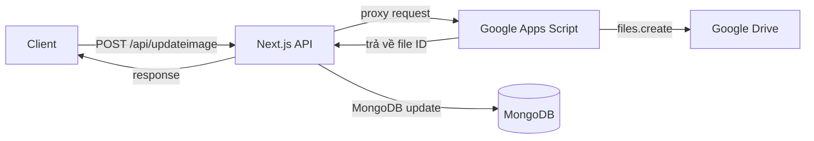

# Google Drive Upload - Sự cố & Phân tích

## Hiện trạng

Lỗi xảy ra khi upload hình ảnh lên Google Drive qua API `/api/updateimage`:

```
request to https://oauth2.googleapis.com/token failed
```

**Nguyên nhân:** Service account `air-900@systemair-441909.iam.gserviceaccount.com` không thể xin được OAuth token từ Google (key có thể hết hạn/đã bị revoke).

## Thông tin cấu hình hiện tại

| Thông số | Giá trị |
|---|---|
| Google Cloud Project | `systemair-441909` |
| Service Account | `air-900@systemair-441909.iam.gserviceaccount.com` |
| Parent Folder ID | `1Ri-Cl-R7Exl7vP6Qy8tDHtoiSqMXVmhf` (có thể ghi đè qua env `DRIVE_COURSE_FOLDER_ID`) |
| Dung lượng Drive đã dùng | 1.26 GB / 15 GB (vẫn còn nhiều) |

## Kiến trúc hiện tại

```
Calendar UI → POST /api/updateimage → Google Drive API (service account)
                                          ├── files.create({ parents: [folderId], supportsAllDrives: true })
                                          └── MongoDB: PostCourse.Detail.$.DetailImage.push()
```

- Mỗi buổi học (session) có `Image` / `folderId` là ID của thư mục con trên Drive
- File được upload vào thư mục đó
- `supportsAllDrives: true` đã được bật ở mọi nơi

## Các file liên quan

| File | Vai trò |
|---|---|
| `src/app/api/(course)/updateimage/route.js` | API upload/replace/delete image (POST/PUT/DELETE) |
| `src/app/api/(course)/calendar/[id]/route.js` | API trả về dữ liệu buổi học (chứa `session.Image` = folderId) |
| `src/app/calendar/[id]/ui/formimage/index.js` | Component upload hình ảnh (gọi `/api/updateimage`) |
| `src/app/calendar/[id]/ui/formimages/index.js` | Component gán hình ảnh cho học sinh |
| `src/function/drive/folder.js` | Tạo Drive client, tạo thư mục trên Drive |
| `src/function/drive/image.js` | Upload/xoá file trên Drive |
| `src/app/api/(course)/course/route.js` | Tạo thư mục Drive khi tạo khoá học |
| `src/function/drive/appscript.js` | Các AppScript URL cho Zalo (KHÔNG liên quan upload) |

## Cách 1: Sửa service account (giữ nguyên code)

**Các bước:**
1. Vào https://console.cloud.google.com/apis/credentials
2. Chọn Service Account `air-900@systemair-441909.iam.gserviceaccount.com`
3. Kiểm tra danh sách key còn hoạt động không, nếu hết hạn → tạo key mới (JSON)
4. Cập nhật `GOOGLE_PRIVATE_KEY` trong `.env.development` và Dockerfile
5. Thêm email service account vào shared Drive (folder `1Ri-Cl-R7Exl7vP6Qy8tDHtoiSqMXVmhf`) với quyền **Editor**

**Ưu điểm:**
- Không cần sửa code
- Tận dụng luồng xử lý lỗi, rollback, DB update đang hoạt động ổn định

**Nhược điểm:**
- Key tồn tại vĩnh viễn nhưng có thể bị revoke bất kỳ lúc nào (bảo mật, policy tổ chức)
- Phải quản lý credentials server-side (`.env`, Dockerfile, biến môi trường)
- Mỗi lần key hết hạn / bị revoke → phải tạo key mới + redeploy
- Nếu shared Drive không cho phép service account từ bên ngoài → vẫn lỗi

### Về "Key service account có hạn"

Service account private key **không có ngày hết hạn cố định**. Nó tồn tại vĩnh viễn trừ khi:
- Bạn chủ động xoá / revoke trong Google Cloud Console
- Bị policy tổ chức tự động thu hồi (thường 1-2 năm)
- Google Cloud project bị vô hiệu hoá

Google khuyến cáo rotate key định kỳ vì lý do bảo mật (nếu key bị leak).

### Về "Phải quản lý credentials server-side"

Private key được lưu trong:
- `.env.development` (môi trường local)
- `Dockerfile` (khi build image)
- Biến môi trường trên VPS / cloud provider (nếu deploy)

Rủi ro:
- Key nằm trong source code / Docker image → ai có quyền truy cập server có thể lấy key
- Mỗi lần thay đổi key → phải redeploy server
- Deploy lên môi trường chia sẻ có nguy cơ lộ key

## Cách 2: Chuyển sang dùng AppScript

**Các bước:**
1. Tạo Google Apps Script Web App với endpoint nhận file + folderId, upload lên Drive, trả về file ID
2. Deploy script dưới quyền Google cá nhân (có quyền vào shared Drive)
3. Sửa `src/app/api/(course)/updateimage/route.js`: thay vì gọi service account trực tiếp, proxy request sang AppScript URL
4. Sửa cả POST (upload), PUT (replace), DELETE (xoá) nếu cần



**Ưu điểm:**
- Không phụ thuộc service account (tránh lỗi OAuth token)
- AppScript xài OAuth của Google cá nhân, tự động refresh token
- Upload vào đúng Drive của user (kể cả shared Drive nếu script được cấp quyền)
- Không cần quản lý credentials trên server
- Dễ debug (chạy trực tiếp trong môi trường Google)

**Nhược điểm:**
- Phải sửa code API route (POST, PUT, DELETE)
- AppScript giới hạn: 6 phút timeout, 50MB request, rate limit API
- Thêm 1 hop mạng → chậm hơn một chút
- Cần deploy script dưới quyền user có quyền vào shared Drive
- 20MB upload/ngày (miễn phí), 100MB (Google Workspace)

## So sánh nhanh

| Tiêu chí | Cách 1 (sửa service account) | Cách 2 (AppScript) |
|---|---|---|
| Sửa code | ❌ Không | ✅ Có (API route) |
| Phụ thuộc service account | ✅ Có | ❌ Không |
| Quản lý credentials server-side | ✅ Có | ❌ Không |
| Phức tạp | Thấp | Trung bình |
| Duy trì lâu dài | Phải rotate key định kỳ | Tự động (OAuth refresh) |
| Tốc độ | Nhanh (1 hop) | Chậm hơn (2 hops) |
| Giới hạn | Theo Google API quota | AppScript quota + Google API quota |

## Khuyến nghị

**Thử Cách 1 trước:** kiểm tra key service account trong `.env`, tạo key mới nếu cần, add vào shared Drive. Nếu vẫn lỗi thì chuyển sang Cách 2.
